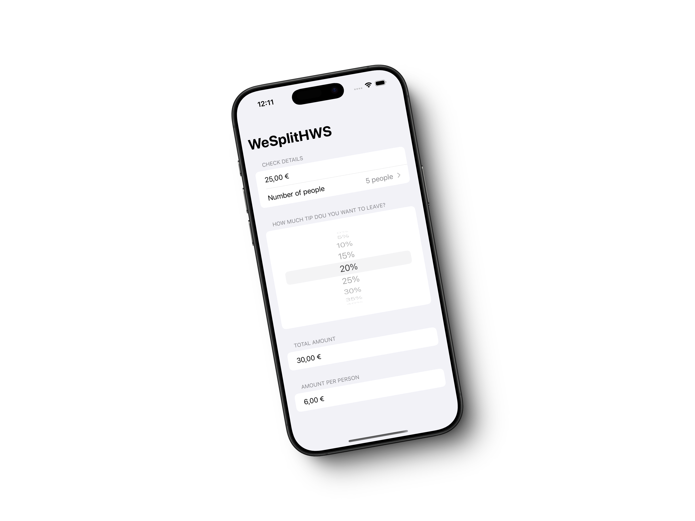

# WeSplitHWS

La aplicación del repositorio se basa en el tutorial de [Paul Hudson](https://x.com/twostraws) [Hacking with Swift - 100 Days of SwiftUI](https://www.hackingwithswift.com/100/swiftui) y los desafíos para completar que propone. Concretamente abarca:

- [Day 16 – Project 1, part one](https://www.hackingwithswift.com/100/swiftui/16)
- [Day 17 – Project 1, part two](https://www.hackingwithswift.com/100/swiftui/17)
- [Day 18 – Project 1, part three](https://www.hackingwithswift.com/100/swiftui/18)

